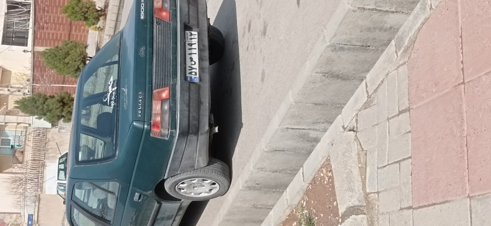

# **License Plate Pipeline**
___
___
# Identify and Verify Persian License Plate

In this project, the whole process of detection, recognition, identification and verification of Persian License Plates is carried out.


# How to install

## Run this command:
```
pip install -r requirements.txt
```

## Download pre-trained weights : 

DTRB recognizer : [link](https://drive.google.com/file/d/1CCsEgGRA-RnhxuGx3ESmeg5lM9m_zwfw/view?usp=sharing) 

Yolo detector : [link](https://drive.google.com/file/d/1h6Pk7ZvWYjF0DB6ae97USEHxjUaKTSYX/view?usp=sharing)

### **and put them into weights folder.**

# How to run

## Identification

**You just need to run `main.py` and address your image with this command:**
 
```
python main.py --input-image YOUR_IMAGE.jpg
```
**Output example :** 

|Input image|Detected Image|Plate Image|
|---|---|---|
||  | |

```
---------------------------------------------
image_path  predicted_labels confidence score
---------------------------------------------
besco             57u11912            0.9984
```
## Verification
**You can use verification mode in two different way :**

### Simple Verification : 
with simple True and False output. Like definition, just run `main.py` but enter `--verification-mode` :  
```
python main.py --verification_mode --input-image YOUR_IMAGE.jpg
```

### Editor Mode : 
edit license plates data after verifying by entering `--editor-mode` :  
```
python main.py --verification_mode --editor-mode --input-image YOUR_IMAGE.jpg
```
**Output examples :**
```
This License Plate isn`t registered!
Add(A), Show Data List(S), Exit(anything else) :
```
and
```
This License has already been registered.
Delete(D), Show Data List(S), Exit(anything else) :
```

**Also you can change threshold using `--threshold` argument**
